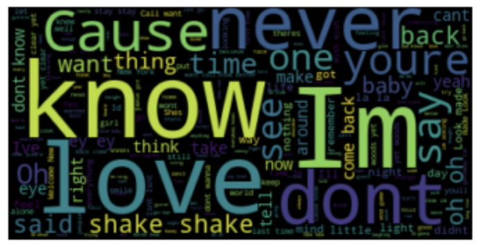

# Taylor_Lyrics
NLG with Markov Chain on Taylor Swift Songs

This project was created with the only goal of cheering up during the difficult times of COVID-19 pandemic. 

I have downloaded a dataset with Taylor Swift's song lyrics ever written and used Markov chain Natural Language Generator to generate new songs! The example of Pseudo Taylor's songs can be seen below, and some more can be found in the PDf file. Cheers!

> At 14 theres just so cool it makes me hate you we break down

> Dont look at your back now

> Saying its gonna be forever

> It was rare I was drowning thats when I caught your eye

> Even now just looking at me you loved me

> And to the nines

> It was the first time you tell me that youre gay

> Were happy free confused and lonely at the phone and mindtwist you

> Id tell you Im crazy

> And you are worlds away

> And I heard about me ooh

> Cause you dont know

> So take a moment of weakness and you

> Yes yes I can see the ending

> And this love is difficult but its alright
